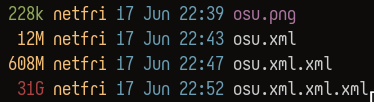

# Binary XML encode/decode



## About
this project tries to give an answer for [embedding binary data in XML](https://stackoverflow.com/questions/19893/how-do-you-embed-binary-data-in-xml).
it uses self-closing XML tags to represent the binary data.
Hours were spent on this project to make sure that it as highly optimized as possible, and for that reason there are some [limitations](#dependencies).

### Performance
My machine contains the following:
 - Void Linux x86-64 (kernel version 6.12.41_1)
 - AMD Ryzen AI 9 365 @ 5.04 GHz (10 cores, 20 threads, L1: 800 KiB, L2: 10 MiB, L3: 24 MiB)
 - 24 GiB DDR4 RAM @ 3205 MHz
 - 1TB (953 GiB) NVME M.2 PCIe (Read 4500 MB/s, Write 3600 MB/s, Read IOPS 600K, Write IOPS 650K)


##### encoding
139.4ms for reading 14.39 MB and writing 736.88 MB.
 - read:  `103.228 MB/s`
 - write: `5286.083 MB/s`

##### decoding
103.3ms for reading 736.88 MB and writing 14.39 MB
 - read:  `7133.398 MB/s`
 - write: `193.303 MB/s`

## Getting Started

### Dependencies
 - `x86-64` architecture
 - minimal linux version of 5.4
 - fasm
 - make
 - cpu with [avx512](https://en.wikipedia.org/wiki/AVX-512#CPUs_with_AVX-512)

###### no need for libc :)

### Example
after [building](#build) the programs, we can run the following commands to demonstrate how this format works:
```shell
echo -n "Hello World!" > hello.txt
build/encode < hello.txt > hello.xml
```

> [!IMPORTANT]
> because of mmap-ing files, reading from stdin, writing from stdout, and piping - are not possible at all on the decoder, and will give an error. using the decoder is only possible by redirecting, which creates a symlink from stdin/stdout to the redirected file, as shown in this example.

firstly, we create a `hello.txt` file with the content `Hello World!`, and by using echo's `-n` flag we ensure that it won't insert a `\n` at the end of the file.
then, we encode the content. we read from `hello.txt` and write to `hello.xml` the encoded XML.

looking into `hello.xml`, we should see the following content:
```xml
<zero/><zero/><zero/><one/><zero/><zero/><one/><zero/><one/><zero/><one/><zero/><zero/><one/><one/><zero/><zero/><zero/><one/><one/><zero/><one/><one/><zero/><zero/><zero/><one/><one/><zero/><one/><one/><zero/><one/><one/><one/><one/><zero/><one/><one/><zero/><zero/><zero/><zero/><zero/><zero/><one/><zero/><zero/><one/><one/><one/><zero/><one/><zero/><one/><zero/><one/><one/><one/><one/><zero/><one/><one/><zero/><zero/><one/><zero/><zero/><one/><one/><one/><zero/><zero/><zero/><one/><one/><zero/><one/><one/><zero/><zero/><zero/><one/><zero/><zero/><one/><one/><zero/><one/><zero/><zero/><zero/><zero/><one/><zero/><zero/>
```

this is one of the most efficient encoding methods known to mankind, and can easily compress data the other way around.

#### Build
```shell
make
```

#### Clean
```shell
make clean
```

## Usage

#### Encoding
```shell
build/encode < [file to encode] > [encoded file]
```

#### Decoding
```shell
build/decode < [file to decode] > [decoded file]
```
